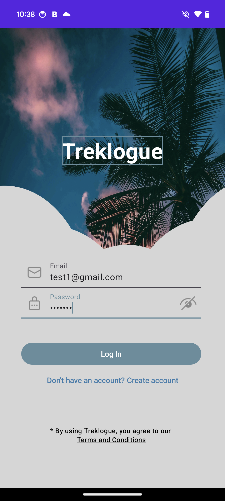
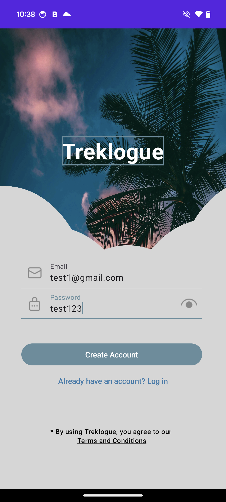
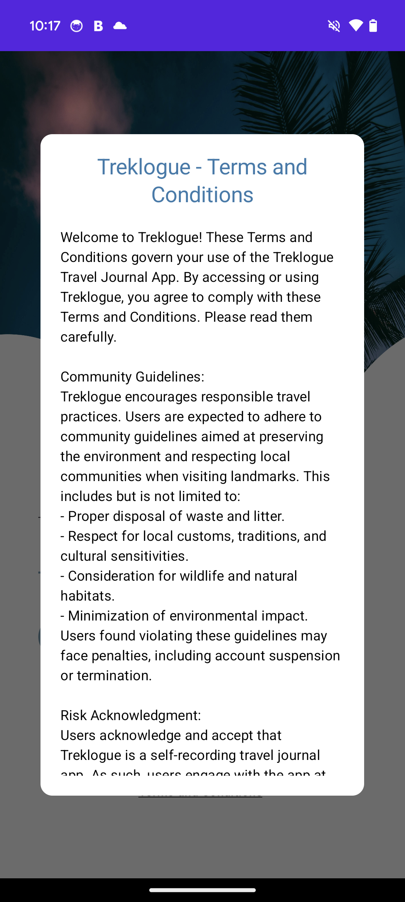
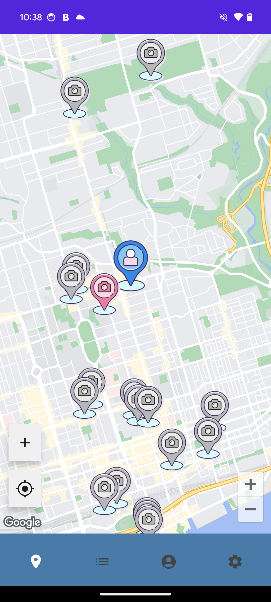
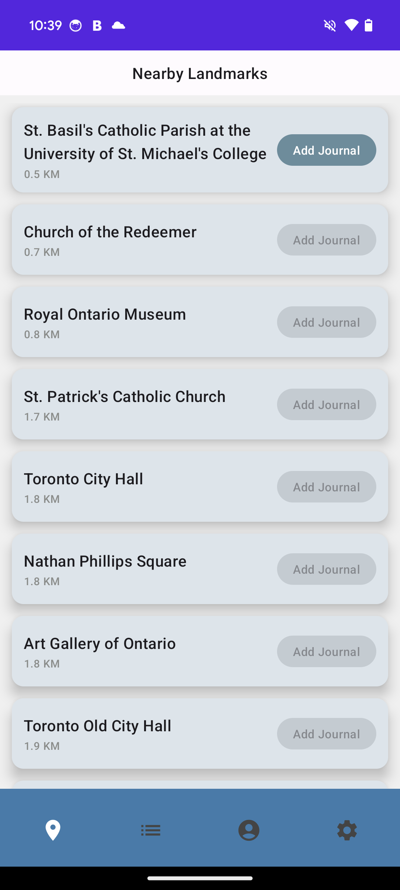
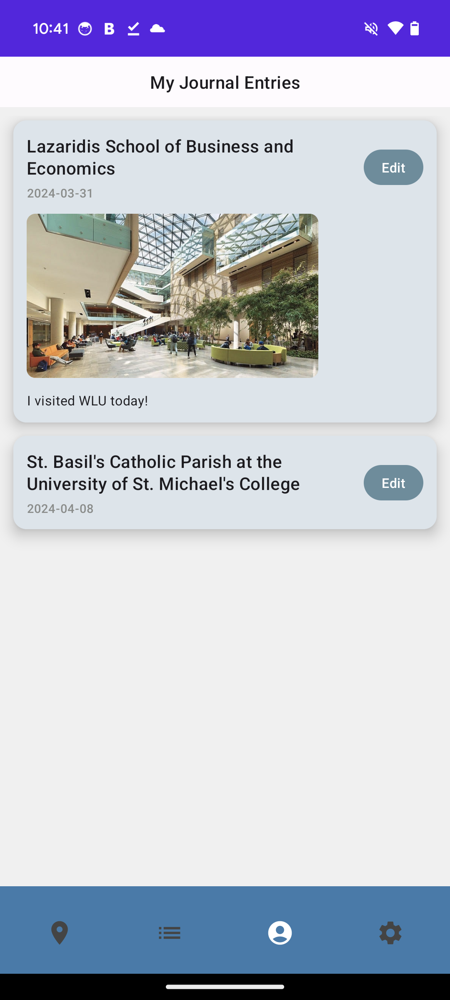
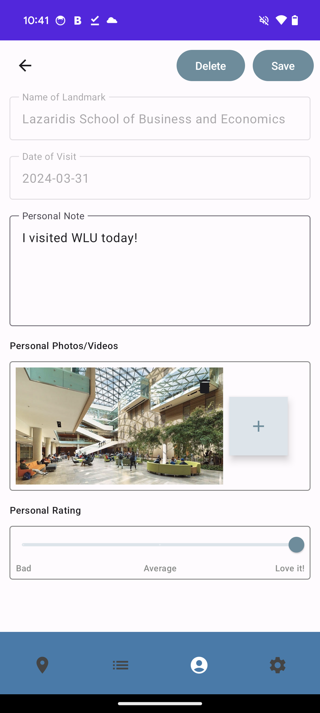
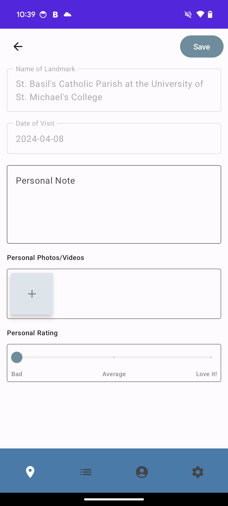
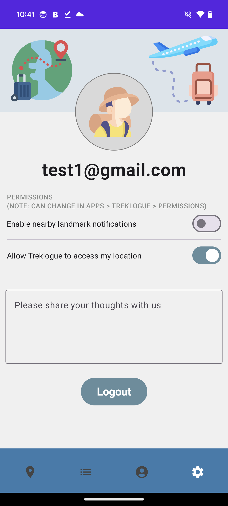
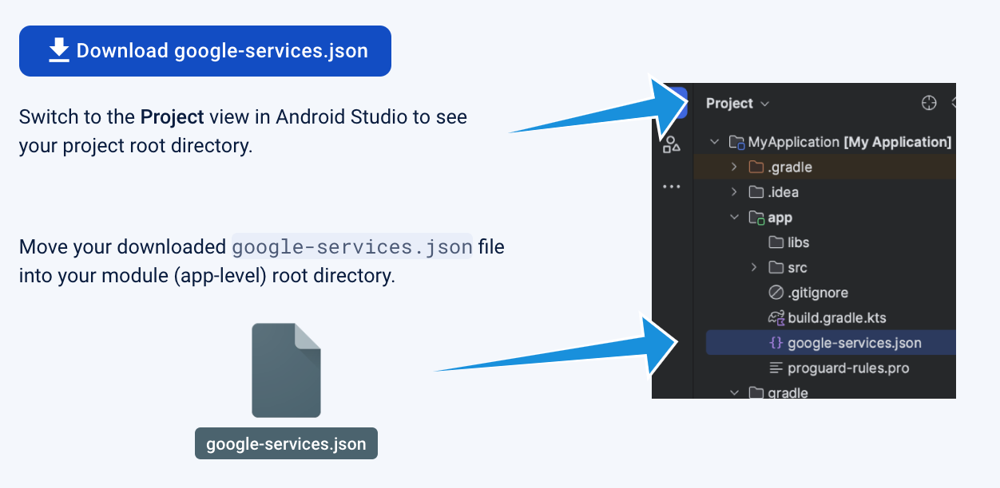

# cs446-group18

### Group Members: 
| Name          | Quest ID | Github Username |
| ------------- | ---------| --------------- |
| Mingyu Liu    | 20832269 | [mingyuliuu](https://github.com/mingyuliuu) | 
| Alice Wang    | 20823650 | [alicewangzm](https://github.com/alicewangzm) |
| Danyang Wang  | 20882639 | [danyang0108](https://github.com/danyang0108) |
| Michael Huang | 20898233 | [hlxmh](https://github.com/hlxmh) |
| Kelly Shen    | 20873010 | [kellyyys](https://github.com/Kellyyys) |
| Yingjia Zhang | 20876108 | [Yingjia-Z](https://github.com/Yingjia-Z) |

# Treklogue
<table>
<tr>
<td>
 Treklogue is a travelling journal that allows users to "check in" at landmarks. Users are only allowed to check in when they are close to the landmark. They can write a short description of how they are feeling at the moment and upload any pictures they took from the landmark.
</td>
</tr>
</table>

## Gallery

### Login Page and Terms and Conditions
<table>
 <tr>
       <td></td>
       <td></td>
       <td></td>
 </tr>
</table>

### Main Screen
<table>
 <tr>
     <td></td>
     <td></td>
     <td></td>
       
 </tr>
 <tr>
  <td></td>
         <td></td>
 </tr>
</table>

### Profile Page
<table>
 <tr>
       <td></td>
 </tr>
</table>  
  
## Instructions
<table>
 <tr>
  Treklogue uses Google Places APIs and Firebase. You need to setup those two apis in order for it to function. 
  Firebase Setup: 
  
  Google Places API Setup:  
  Add your API key as "val apiKey = [INSERT YOUR KEY]" around line 69 in app/src/main/java/ca/uwaterloo/treklogue/ui/screens/ListScreen.kt  
 </tr>
</table>

## Built with 

- Kotlin
- Google Places API
- [Cloud Storage for Firebase](https://firebase.google.com/docs/storage)  
